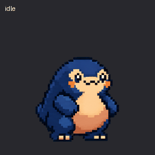
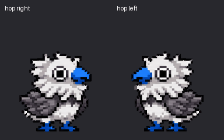

# Codachi


Codachi brings cute, animated monster pets to your workspace.

Watch them hatch from eggs, run around while you code, and evolve as they gain experience from your coding activity.


## Screenshots

### Panel Mode


### Explorer Mode


## Features

- Hatch random pets with original designs and animations.
- Gain XP by writing more code.
- When enough XP is gained, your monster will level up!
- Choose between Panel mode or Explorer mode to display your pet.

## Getting Started

### Codachi-Inspired Codex Pets

We have a few Codachi-inspired pet designs for Codex and ChatGPT in `media/dot/`.





To create a custom pet using one of these designs:

1. Download its GIF from `media/dot/`, or use the local file in a clone of this repository.
2. In the ChatGPT desktop app, open **Settings > Pets > Create pet**.
3. In the new chat, provide the animation as a reference and describe the pet you want. For example:

   > Create a custom pet based on this Codachi-inspired animation. Preserve its pixel-art style, colors, and animations.

4. Once creation finishes, return to **Settings > Pets**, select **Refresh**, and choose your new pet. Enter `/pet` to show it.

These GIFs are animation references. The web app's **Upload pet** feature requires a transparent PNG or WebP sprite sheet, so the GIFs cannot be uploaded there directly.

In Codex CLI, use `/pets` to choose a compatible installed pet in a supported terminal.

Official pet setup and terminal requirements:

https://learn.chatgpt.com/docs/pets

### Panel Mode (Default)

Launch VS Code Quick Open (`Ctrl` + `Shift` + `P`), paste the following command, and press Enter.

```
Codachi: Show Panel
```

This will show the Codachi panel. Your pet will wander around here.

### Explorer Mode

To use Explorer mode instead, run:

```
Codachi: Open Explorer View
```

Your pet will now appear in the Explorer panel. This keeps your pet visible while you work.

### Spawning a New Pet

To spawn a new pet, hit `Ctrl` + `Shift` + `P`, paste the following command, and press Enter:

```
Codachi: New Pet
```

Your pet will appear (inside an egg). Start typing to hatch your pet.

Your pet will gain XP as you code in either mode.

### Switching Between Modes

You can switch between Panel and Explorer modes in two ways:

1. **Via Settings**:

   - Open VS Code Settings (`Ctrl` + `,`)
   - Search for "codachi.position"
   - Select either "panel" or "explorer"

2. **Via Commands**:
   - Use `Codachi: Show Panel` to switch to Panel mode
   - Use `Codachi: Open Explorer View` to switch to Explorer mode

### Enabling the XP Bar

By default, the XP bar is hidden. To enable it:

   - Open VS Code Settings (`Ctrl` + `,`)
   - Search for `codachi.showXP`
   - Check the box to enable the XP bar

The XP counter will appear in the top left corner of your Codachi view, showing your current XP and the total XP needed to reach the next level.
